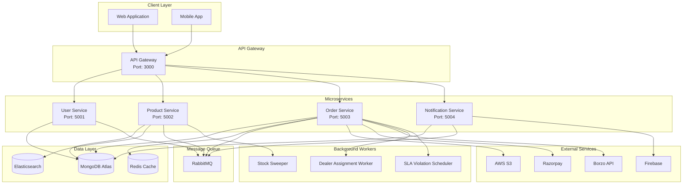
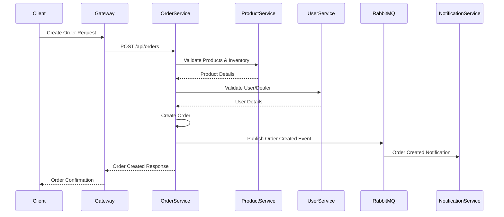
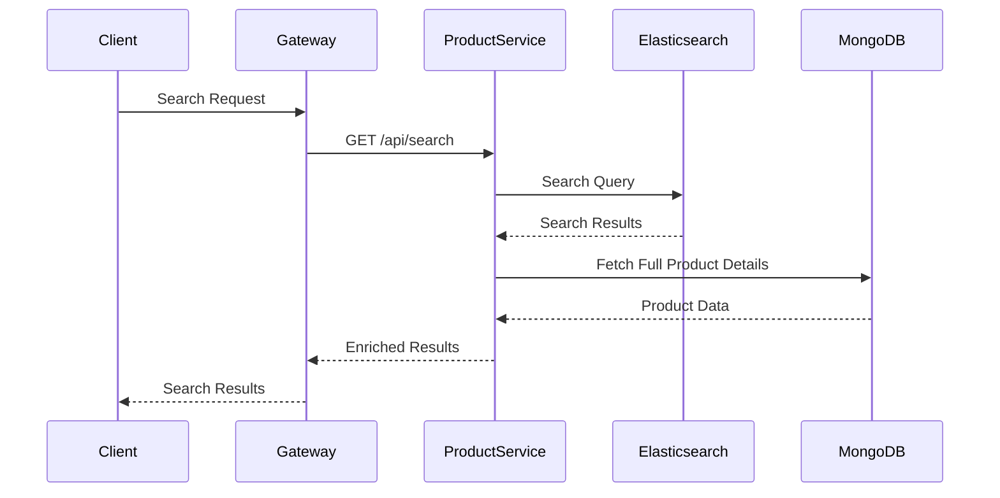

# TopRise Backend - E-Commerce Platform

A comprehensive microservices-based e-commerce backend platform for automotive parts and accessories, built with Node.js, Express, and MongoDB.

## 📋 Table of Contents

- [Overview](#overview)
- [Architecture](#architecture)
- [Microservices](#microservices)
- [Technology Stack](#technology-stack)
- [Key Features](#key-features)
- [System Architecture Diagram](#system-architecture-diagram)
- [Data Flow](#data-flow)
- [Getting Started](#getting-started)
- [API Documentation](#api-documentation)
- [Deployment](#deployment)

## 🎯 Overview

TopRise is a full-featured e-commerce platform designed for automotive parts and accessories. The system handles product catalog management, order processing, user management, inventory tracking, fulfillment workflows, and comprehensive analytics.

### Core Capabilities

- **Product Management**: Categories, brands, variants, inventory tracking
- **Order Processing**: Complete order lifecycle from creation to delivery
- **User Management**: Customers, dealers, employees with role-based access
- **Fulfillment**: Picklists, SKU tracking, dealer assignments
- **Analytics & Reporting**: Comprehensive dashboards and audit logs
- **Document Processing**: Upload-to-order workflow
- **SLA Management**: Service level agreement tracking and violations
- **Payment Integration**: Razorpay payment gateway
- **Delivery Integration**: Borzo delivery service

## 🏗️ Architecture

The system follows a **microservices architecture** pattern with the following components:

```
┌─────────────────────────────────────────────────────────────┐
│                      API Gateway                            │
│                      (Port: 3000)                           │
└───────────────────────┬─────────────────────────────────────┘
                        │
        ┌───────────────┼───────────────┐
        │               │               │
        ▼               ▼               ▼
┌──────────────┐ ┌──────────────┐ ┌──────────────┐
│ User Service │ │Product Service│ │Order Service │
│  (Port: 5001)│ │  (Port: 5002) │ │  (Port: 5003)│
└──────────────┘ └──────────────┘ └──────────────┘
        │               │               │
        └───────────────┼───────────────┘
                        │
        ┌───────────────┼───────────────┐
        │               │               │
        ▼               ▼               ▼
┌──────────────┐ ┌──────────────┐ ┌──────────────┐
│Notification │ │   MongoDB     │ │   RabbitMQ   │
│  Service    │ │   Database    │ │  Message Bus │
│ (Port: 5004)│ │               │ │              │
└──────────────┘ └──────────────┘ └──────────────┘
```

## 🔧 Microservices

### 1. **User Service** (Port: 5001)
**Responsibilities:**
- User authentication and authorization
- Customer and dealer management
- Employee management with roles and permissions
- Address management
- Pincode serviceability
- User audit logging

**Key Endpoints:**
- `/api/users/login` - User authentication
- `/api/users/dealer/*` - Dealer management
- `/api/users/employee/*` - Employee management
- `/api/users/audit/*` - Audit logs

### 2. **Product Service** (Port: 5002)
**Responsibilities:**
- Product catalog management
- Category and subcategory hierarchy
- Brand and variant management
- Inventory tracking
- Product search and filtering
- Banner management
- Purchase orders
- Product approval workflow

**Key Endpoints:**
- `/api/category/*` - Category management
- `/api/product/*` - Product CRUD operations
- `/api/brand/*` - Brand management
- `/api/search/*` - Intelligent search
- `/api/reports/*` - Product analytics

### 3. **Order Service** (Port: 5003)
**Responsibilities:**
- Order creation and management
- Cart and wishlist management
- Payment processing (Razorpay)
- Order fulfillment (picklists, SKU tracking)
- Dealer assignment
- SLA violation tracking
- Returns and refunds
- Document upload to order workflow
- Borzo delivery integration
- Analytics and reporting

**Key Endpoints:**
- `/api/orders/*` - Order management
- `/api/carts/*` - Shopping cart
- `/api/payment/*` - Payment processing
- `/api/picklists/*` - Fulfillment picklists
- `/api/analytics/*` - Order analytics
- `/api/documents/*` - Document upload system

### 4. **Notification Service** (Port: 5004)
**Responsibilities:**
- Push notifications
- Email notifications
- SMS notifications
- Notification templates
- Notification settings

**Key Endpoints:**
- `/api/notification/*` - Notification management
- `/api/notification/template/*` - Template management

## 🛠️ Technology Stack

### Backend
- **Runtime**: Node.js
- **Framework**: Express.js
- **Database**: MongoDB (MongoDB Atlas)
- **Message Queue**: RabbitMQ
- **Cache**: Redis
- **Search Engine**: Elasticsearch
- **Logging**: Kibana

### External Services
- **Cloud Storage**: AWS S3
- **Payment Gateway**: Razorpay
- **Delivery Service**: Borzo API
- **Geocoding**: Nominatim (OpenStreetMap)
- **Firebase**: Push notifications

### Infrastructure
- **Containerization**: Docker
- **Orchestration**: Docker Compose
- **API Gateway**: Custom Express-based gateway

## ✨ Key Features

### 1. **Product Management**
- Hierarchical category system (Category → Subcategory → Type)
- Multi-variant product support
- Intelligent search with brand detection
- Product approval workflow (QC and Live status)
- Inventory tracking with stock sweeper
- Elasticsearch integration for fast search

### 2. **Order Management**
- Complete order lifecycle: Confirmed → Assigned → Packed → Shipped → Delivered
- Granular SKU-level tracking
- Multi-dealer order assignment
- Automatic dealer assignment based on inventory
- Picklist generation for fulfillment staff
- Real-time order status updates

### 3. **Fulfillment System**
- Picklist creation and management
- SKU scanning and tracking
- Fulfillment staff assignment
- Dealer packing workflow
- Shipping integration with Borzo
- Geocoding for delivery addresses

### 4. **SLA Management**
- Configurable SLA types (packing, shipping, delivery)
- Automatic SLA violation detection
- SLA violation tracking and reporting
- Dealer performance monitoring
- SLA breach notifications

### 5. **Document Upload System**
- Multi-file upload (PDF/Images)
- Document-to-order conversion
- Admin review and approval workflow
- Customer contact tracking
- Order creation from documents

### 6. **Analytics & Reporting**
- Role-based dashboards
- Real-time KPIs
- Comprehensive audit logging
- Export capabilities (CSV, Excel, PDF)
- Scheduled reports
- Performance monitoring

### 7. **Payment Processing**
- Razorpay integration
- Payment status tracking
- Refund management
- Payment analytics

### 8. **User Management**
- Role-based access control (RBAC)
- Multiple user types: Customer, Dealer, Employee, Admin
- Permission matrix system
- Employee activation/deactivation
- Audit trail for user actions

## 📊 System Architecture Diagram



## 🔄 Data Flow

### Order Creation Flow



### Product Search Flow



## 🚀 Getting Started

### Prerequisites

- Node.js (v14 or higher)
- Docker and Docker Compose
- MongoDB Atlas account (or local MongoDB)
- AWS S3 bucket (for file storage)
- Razorpay account (for payments)

### Installation

1. **Clone the repository**
```bash
git clone <repository-url>
cd TOPRISEBACKEND
```

2. **Install dependencies**
```bash
npm install
cd services/user-service && npm install
cd ../product-service && npm install
cd ../order-service && npm install
cd ../notification-service && npm install
```

3. **Configure environment variables**
   - Create `.env.development` files in each service directory
   - Configure MongoDB connection strings
   - Set up AWS S3 credentials
   - Configure Razorpay keys

4. **Start services with Docker Compose**
```bash
docker-compose up -d
```

### Service URLs

- **API Gateway**: http://localhost:3000
- **User Service**: http://localhost:5001
- **Product Service**: http://localhost:5002
- **Order Service**: http://localhost:5003
- **Notification Service**: http://localhost:5004
- **RabbitMQ Management**: http://localhost:15672
- **Kibana**: http://localhost:5601

## 📚 API Documentation

### Base URLs

- **Development**: `http://localhost:3000`
- **Production**: `https://api.toprise.in`

### Authentication

All protected endpoints require a JWT token in the Authorization header:

```bash
Authorization: Bearer <your-jwt-token>
```

### Common Endpoints

#### User Service
- `POST /api/users/login` - User login
- `POST /api/users/signup` - User registration
- `GET /api/users/dealer/:id` - Get dealer details

#### Product Service
- `GET /api/category` - List categories
- `GET /api/product` - List products
- `GET /api/search` - Search products

#### Order Service
- `POST /api/orders` - Create order
- `GET /api/orders/:id` - Get order details
- `GET /api/orders/stats` - Order statistics

For detailed API documentation, see:
- [Complete API Reference](./COMPLETE_API_REFERENCE.md)
- [Comprehensive Reporting APIs](./COMPREHENSIVE_REPORTING_APIS_DOCUMENTATION.md)
- [Analytics Dashboard APIs](./services/order-service/ANALYTICS_DASHBOARD_API_DOCUMENTATION.md)

## 🚢 Deployment

### Production Deployment

1. **Build Docker images**
```bash
docker-compose -f docker-compose.prod.yml build
```

2. **Deploy services**
```bash
docker-compose -f docker-compose.prod.yml up -d
```

3. **Monitor services**
```bash
docker-compose -f docker-compose.prod.yml logs -f
```

For detailed deployment instructions, see [Production Deployment Guide](./PRODUCTION_DEPLOYMENT_GUIDE.md).

## 📁 Project Structure

```
TOPRISEBACKEND/
├── api-gateway/          # API Gateway service
├── services/
│   ├── user-service/     # User management service
│   ├── product-service/  # Product catalog service
│   ├── order-service/    # Order management service
│   └── notification-service/ # Notification service
├── packages/             # Shared packages
│   ├── config/          # Shared configuration
│   └── utils/           # Shared utilities
├── docker-compose.yaml   # Development Docker Compose
├── docker-compose.prod.yml # Production Docker Compose
└── README.md            # This file
```

## 🔐 Security

- JWT-based authentication
- Role-based access control (RBAC)
- Permission matrix system
- Audit logging for all actions
- CORS configuration
- Input validation and sanitization

## 📊 Monitoring & Logging

- **Elasticsearch**: Centralized logging
- **Kibana**: Log visualization and analysis
- **Audit Logs**: Comprehensive action tracking
- **Health Checks**: Service health monitoring

## 🤝 Contributing

1. Create a feature branch
2. Make your changes
3. Test thoroughly
4. Submit a pull request

## 📄 License

[Your License Here]

## 📞 Support

For issues and questions, please contact the development team.

---

**Built with ❤️ for TopRise**
