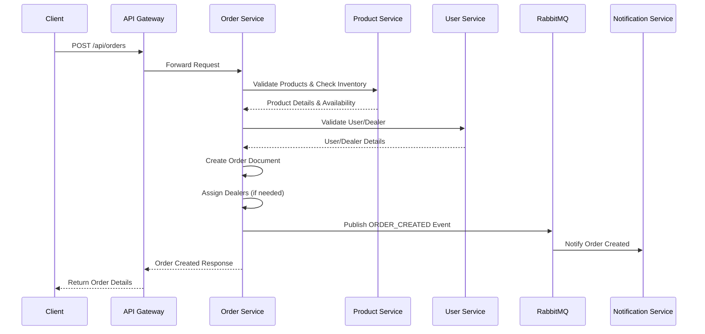
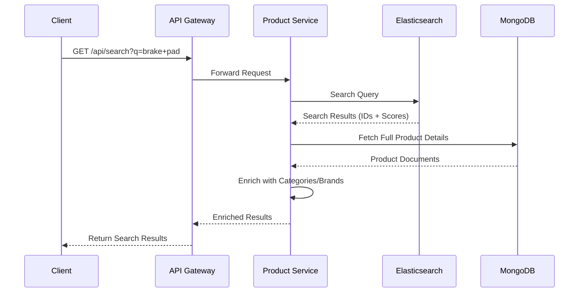
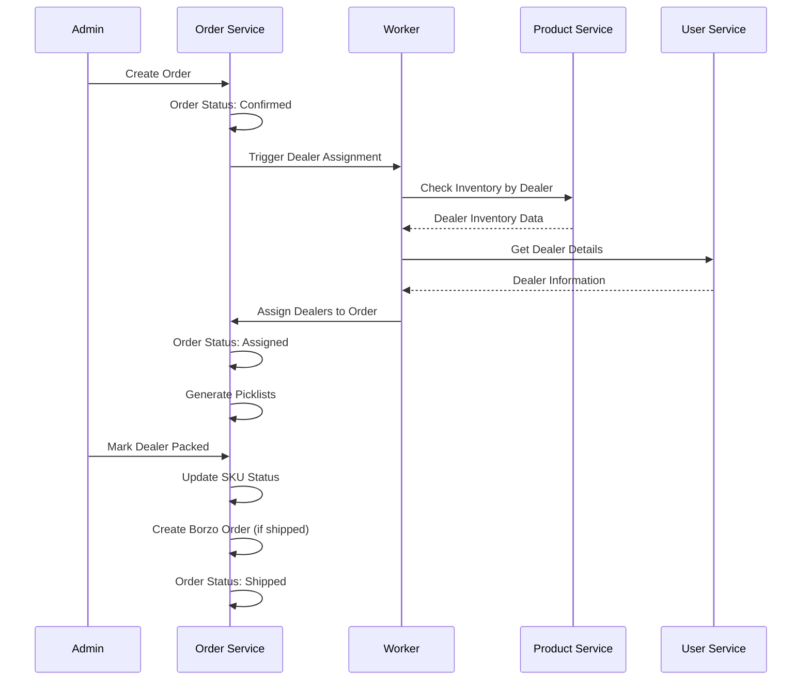
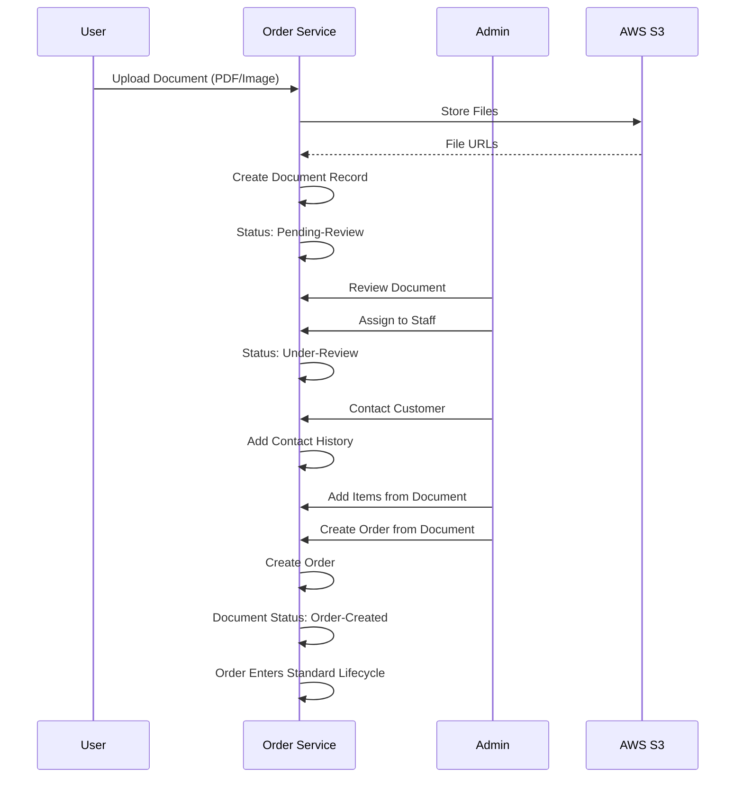

# TopRise Backend - High-Level System Design Documentation

## 📋 Table of Contents

1. [System Overview](#system-overview)
2. [Architecture Patterns](#architecture-patterns)
3. [Microservices Architecture](#microservices-architecture)
4. [Data Architecture](#data-architecture)
5. [Communication Patterns](#communication-patterns)
6. [Security Architecture](#security-architecture)
7. [Scalability & Performance](#scalability--performance)
8. [Deployment Architecture](#deployment-architecture)
9. [Key Workflows](#key-workflows)
10. [Technology Decisions](#technology-decisions)

---

## 🎯 System Overview

### Purpose
TopRise is a comprehensive e-commerce platform for automotive parts and accessories, designed to handle:
- Large-scale product catalog management
- Complex order processing with multi-dealer fulfillment
- Real-time inventory tracking
- Advanced analytics and reporting
- Document-based order creation
- SLA monitoring and violation tracking

### System Characteristics
- **Type**: Microservices-based distributed system
- **Scale**: Designed for high-volume transactions
- **Availability**: High availability with service redundancy
- **Consistency**: Eventual consistency with strong consistency where needed
- **Performance**: Sub-second response times for most operations

---

## 🏗️ Architecture Patterns

### 1. Microservices Architecture
The system is decomposed into independent, loosely coupled services:

```
┌─────────────────────────────────────────────────────────────┐
│                    Microservices Layer                        │
├──────────────┬──────────────┬──────────────┬────────────────┤
│ User Service │Product Service│Order Service │Notification    │
│              │              │              │Service         │
└──────────────┴──────────────┴──────────────┴────────────────┘
```

**Benefits:**
- Independent deployment and scaling
- Technology diversity
- Fault isolation
- Team autonomy

### 2. API Gateway Pattern
Single entry point for all client requests:

```
Client → API Gateway → Microservices
```

**Responsibilities:**
- Request routing
- Authentication/Authorization
- Rate limiting
- Request/Response transformation
- Load balancing

### 3. Event-Driven Architecture
Asynchronous communication via message queue:

```
Service A → RabbitMQ → Service B
```

**Use Cases:**
- Order creation notifications
- Inventory updates
- User registration events
- Audit log events

### 4. CQRS (Command Query Responsibility Segregation)
Separate read and write models:
- **Write**: MongoDB for transactional data
- **Read**: Elasticsearch for search and analytics

---

## 🔧 Microservices Architecture

### Service Breakdown

#### 1. User Service (Port: 5001)

**Domain**: User Management, Authentication, Authorization

**Responsibilities:**
- User registration and authentication
- Customer and dealer profile management
- Employee management with roles
- Address and pincode management
- Permission matrix management
- User audit logging

**Data Models:**
- User
- Customer
- Dealer
- Employee
- Address
- Pincode
- PermissionMatrix

**Key Features:**
- JWT token generation and validation
- Role-based access control
- Employee activation/deactivation workflow
- Dealer category assignment
- Multi-address support

**Dependencies:**
- MongoDB (user data)
- RabbitMQ (event publishing)
- Product Service (category validation)

---

#### 2. Product Service (Port: 5002)

**Domain**: Product Catalog, Inventory, Categories

**Responsibilities:**
- Product catalog management
- Category hierarchy (Category → Subcategory → Type)
- Brand and variant management
- Inventory tracking and updates
- Product search and filtering
- Banner management
- Purchase order management
- Product approval workflow

**Data Models:**
- Product
- Category
- SubCategory
- Type
- Brand
- Variant
- Banner
- PurchaseOrder
- Inventory

**Key Features:**
- Hierarchical category system
- Multi-variant product support
- Intelligent search with brand detection
- Elasticsearch integration
- Stock sweeper for inventory updates
- Product approval workflow (QC/Live status)

**Dependencies:**
- MongoDB (product data)
- Elasticsearch (search index)
- RabbitMQ (inventory events)
- AWS S3 (product images)

---

#### 3. Order Service (Port: 5003)

**Domain**: Order Management, Fulfillment, Payments

**Responsibilities:**
- Order creation and lifecycle management
- Shopping cart and wishlist
- Payment processing (Razorpay)
- Order fulfillment (picklists, SKU tracking)
- Dealer assignment and management
- SLA violation tracking
- Returns and refunds
- Document upload to order workflow
- Borzo delivery integration
- Analytics and reporting

**Data Models:**
- Order
- Cart
- WishList
- PickList
- Payment
- Refund
- Return
- DocumentUpload
- SLAViolation
- Ticket

**Key Features:**
- Complete order lifecycle management
- Granular SKU-level tracking
- Multi-dealer order assignment
- Automatic dealer assignment algorithm
- Picklist generation for fulfillment
- Real-time order status updates
- SLA monitoring and violation detection
- Document-to-order conversion
- Borzo delivery integration with geocoding

**Dependencies:**
- MongoDB (order data)
- Redis (caching, job queues)
- RabbitMQ (order events)
- User Service (user/dealer validation)
- Product Service (product/inventory validation)
- Razorpay API (payments)
- Borzo API (delivery)
- AWS S3 (document storage)
- Nominatim API (geocoding)

---

#### 4. Notification Service (Port: 5004)

**Domain**: Notifications, Messaging

**Responsibilities:**
- Push notifications (Firebase)
- Email notifications
- SMS notifications
- Notification template management
- Notification settings

**Data Models:**
- Notification
- NotificationTemplate
- NotificationSetting
- Action

**Key Features:**
- Multi-channel notifications
- Template-based messaging
- User notification preferences
- Notification history

**Dependencies:**
- MongoDB (notification data)
- RabbitMQ (notification events)
- Firebase (push notifications)
- Email service (SMTP)
- SMS service (third-party)

---

## 💾 Data Architecture

### Database Strategy

#### MongoDB (Primary Database)
Each service has its own MongoDB database/collection:

```
User Service DB:
├── users
├── customers
├── dealers
├── employees
└── addresses

Product Service DB:
├── products
├── categories
├── brands
├── variants
└── inventory

Order Service DB:
├── orders
├── carts
├── picklists
├── payments
└── sla_violations

Notification Service DB:
├── notifications
└── templates
```

**Database Design Principles:**
- Service-specific databases for isolation
- Document-based schema for flexibility
- Indexed fields for performance
- Embedded documents where appropriate
- References for cross-service data

#### Elasticsearch (Search & Analytics)
- Product search index
- Full-text search capabilities
- Aggregation queries for analytics
- Real-time index updates

#### Redis (Caching & Queues)
- Session storage
- Cache for frequently accessed data
- Job queue for background processing
- Rate limiting counters

---

## 🔄 Communication Patterns

### 1. Synchronous Communication (HTTP/REST)

**Use Cases:**
- Real-time data fetching
- Immediate validation
- Transactional operations

**Pattern:**
```
Service A → HTTP Request → Service B
Service B → HTTP Response → Service A
```

**Examples:**
- Order Service → Product Service: Validate product availability
- Order Service → User Service: Validate user/dealer
- User Service → Product Service: Fetch category details

### 2. Asynchronous Communication (Message Queue)

**Use Cases:**
- Event notifications
- Background processing
- Decoupled service communication

**Pattern:**
```
Service A → Publish Event → RabbitMQ
RabbitMQ → Consume Event → Service B
```

**Event Types:**
- `USER_CREATED`
- `ORDER_CREATED`
- `PRODUCT_UPDATED`
- `INVENTORY_CHANGED`
- `PAYMENT_RECEIVED`

### 3. Service Discovery

**Current Implementation:**
- Direct service-to-service communication via service names (Docker network)
- Hardcoded service URLs in development
- Environment-based URLs in production

**Future Enhancement:**
- Service registry (Consul/Eureka)
- Dynamic service discovery
- Load balancing

---

## 🔐 Security Architecture

### Authentication & Authorization

#### JWT-Based Authentication
```
1. User Login → User Service
2. User Service → Generate JWT Token
3. Client → Store Token
4. Client → Include Token in Requests
5. API Gateway/Service → Validate Token
```

#### Role-Based Access Control (RBAC)

**Roles:**
- `Super-admin`: Full system access
- `Fulfillment-Admin`: Order and fulfillment management
- `Inventory-Admin`: Product and inventory management
- `Analytics-Admin`: Reports and analytics access
- `Dealer`: Dealer-specific operations
- `Customer`: Customer-specific operations
- `Employee`: Employee-specific operations

#### Permission Matrix
- Granular permissions per role
- Resource-level access control
- Action-based permissions (read, write, delete)

### Security Measures
- **CORS**: Configured whitelist for allowed origins
- **Input Validation**: Request validation middleware
- **SQL Injection Prevention**: MongoDB parameterized queries
- **XSS Prevention**: Input sanitization
- **Rate Limiting**: Redis-based rate limiting
- **Audit Logging**: Comprehensive action tracking

---

## ⚡ Scalability & Performance

### Horizontal Scaling
- **Stateless Services**: All services are stateless, allowing horizontal scaling
- **Load Balancing**: API Gateway can distribute load across service instances
- **Database Sharding**: MongoDB supports sharding for large datasets

### Caching Strategy
- **Redis Cache**: Frequently accessed data
- **Application-Level Cache**: In-memory caching for static data
- **CDN**: Static assets (images, documents) via S3

### Performance Optimizations
- **Database Indexing**: Strategic indexes on frequently queried fields
- **Pagination**: All list endpoints support pagination
- **Elasticsearch**: Fast product search
- **Connection Pooling**: MongoDB connection pooling
- **Async Processing**: Background jobs for heavy operations

### Background Workers
- **Dealer Assignment Worker**: Processes order assignments asynchronously
- **Stock Sweeper**: Periodic inventory updates
- **SLA Violation Scheduler**: Monitors and records SLA violations
- **Ticket Assignment Worker**: Automatic ticket assignment

---

## 🚀 Deployment Architecture

### Container Architecture

```
┌─────────────────────────────────────────────────────────┐
│                    Docker Network                        │
├─────────────────────────────────────────────────────────┤
│                                                          │
│  ┌──────────────┐  ┌──────────────┐  ┌──────────────┐ │
│  │ API Gateway  │  │ User Service │  │Product Service││
│  │  Container   │  │  Container   │  │   Container  │ │
│  └──────────────┘  └──────────────┘  └──────────────┘ │
│                                                          │
│  ┌──────────────┐  ┌──────────────┐  ┌──────────────┐ │
│  │Order Service │  │Notification  │  │   RabbitMQ   │ │
│  │  Container   │  │   Service    │  │   Container  │ │
│  └──────────────┘  └──────────────┘  └──────────────┘ │
│                                                          │
│  ┌──────────────┐  ┌──────────────┐  ┌──────────────┐ │
│  │    Redis     │  │  MongoDB     │  │ Elasticsearch│ │
│  │  Container   │  │  Container   │  │   Container  │ │
│  └──────────────┘  └──────────────┘  └──────────────┘ │
│                                                          │
│  ┌──────────────┐  ┌──────────────┐                     │
│  │    Kibana    │  │   Worker    │                     │
│  │  Container   │  │  Containers │                     │
│  └──────────────┘  └──────────────┘                     │
│                                                          │
└─────────────────────────────────────────────────────────┘
```

### Deployment Environments

#### Development
- Local Docker Compose setup
- Hot-reload enabled
- Development databases
- Debug logging enabled

#### Staging
- Cloud-based deployment
- Staging databases
- Production-like configuration
- Monitoring enabled

#### Production
- Cloud-based deployment (AWS/DigitalOcean)
- Production databases (MongoDB Atlas)
- SSL/TLS encryption
- Monitoring and alerting
- Backup and disaster recovery

---

## 🔄 Key Workflows

### 1. Order Creation Workflow



### 2. Product Search Workflow



### 3. Fulfillment Workflow



### 4. Document Upload to Order Workflow



---

## 🛠️ Technology Decisions

### Why Microservices?
- **Scalability**: Independent scaling of services
- **Technology Diversity**: Different services can use optimal technologies
- **Team Autonomy**: Teams can work independently
- **Fault Isolation**: Failures in one service don't cascade

### Why MongoDB?
- **Flexible Schema**: Adapts to changing requirements
- **Document Model**: Natural fit for JSON-based APIs
- **Horizontal Scaling**: Sharding support
- **Rich Query Language**: Complex queries and aggregations

### Why RabbitMQ?
- **Reliability**: Message persistence and delivery guarantees
- **Decoupling**: Services communicate without direct dependencies
- **Scalability**: Handle high message volumes
- **Routing**: Flexible message routing patterns

### Why Elasticsearch?
- **Fast Search**: Sub-second search on large datasets
- **Full-Text Search**: Advanced search capabilities
- **Analytics**: Aggregation queries for analytics
- **Real-Time**: Near real-time index updates

### Why Redis?
- **Performance**: In-memory data store for fast access
- **Caching**: Reduce database load
- **Session Storage**: Stateless service support
- **Job Queues**: Background job processing

### Why Docker?
- **Consistency**: Same environment across dev/staging/prod
- **Isolation**: Service isolation and resource management
- **Portability**: Easy deployment across environments
- **Scalability**: Easy horizontal scaling

---

## 📊 System Metrics & Monitoring

### Key Metrics
- **Response Time**: P50, P95, P99 latencies
- **Throughput**: Requests per second
- **Error Rate**: Percentage of failed requests
- **Database Performance**: Query execution times
- **Queue Depth**: Message queue lengths
- **Service Health**: Uptime and availability

### Monitoring Tools
- **Elasticsearch + Kibana**: Centralized logging and analysis
- **Health Checks**: Service health endpoints
- **Audit Logs**: Comprehensive action tracking
- **Error Tracking**: Error logging and alerting

---

## 🔮 Future Enhancements

### Planned Improvements
1. **Service Mesh**: Istio/Linkerd for advanced traffic management
2. **API Versioning**: Versioned APIs for backward compatibility
3. **GraphQL Gateway**: Unified GraphQL API
4. **Event Sourcing**: Complete event history for audit
5. **CQRS Enhancement**: Separate read/write databases
6. **Multi-Region Deployment**: Global availability
7. **Advanced Caching**: Distributed cache with Redis Cluster
8. **Real-Time Updates**: WebSocket support for live updates

---

## 📚 Additional Documentation

- [Complete API Reference](./COMPLETE_API_REFERENCE.md)
- [Production Deployment Guide](./PRODUCTION_DEPLOYMENT_GUIDE.md)
- [Comprehensive Reporting APIs](./COMPREHENSIVE_REPORTING_APIS_DOCUMENTATION.md)
- [Analytics Dashboard Documentation](./services/order-service/ANALYTICS_DASHBOARD_API_DOCUMENTATION.md)
- [Document Upload System](./DOCUMENT_UPLOAD_SYSTEM_DOCUMENTATION.md)
- [SLA Violation Management](./SLA_VIOLATION_MANAGEMENT_IMPLEMENTATION.md)

---

**Document Version**: 1.0  
**Last Updated**: 2025-01-27  
**Maintained By**: TopRise Development Team

